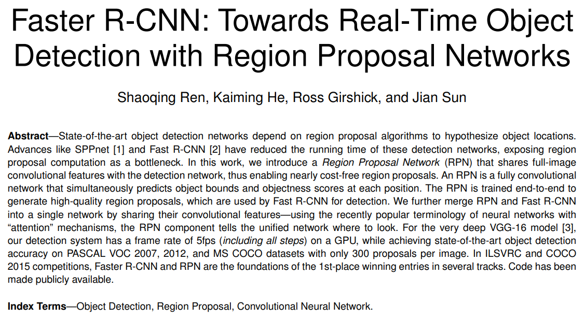
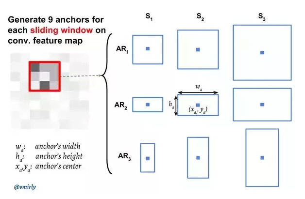
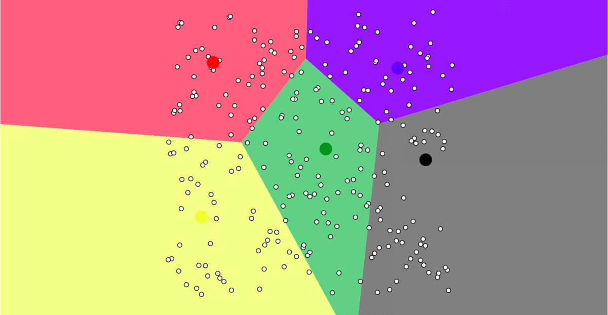

# Faster R-CNN with self-estimated anchor boxes

# Introduction

Faster R-CNN (Faster Region-based Convolutional Neural Network) [[1]](#1) is one of the SOTA *object detection* algorithms right now. It is also the basis for many derived networks for *segmentation*, *3D object detection*, etc. 

Faster R-CNN is an extension of Fast R-CNN [[2]](#2). As its name suggests, Faster R-CNN is faster than Fast R-CNN thanks to the **Region Proposal Network**, which is a fully convolutional network that generates proposals with various scales and aspect ratios. 

# Problem with current Faster R-CNN

Although RPN brings about great speed and result when comparing to many other competitors, we have to manually adjust scales and aspect ratios whenever we train it with different datasets. 

With that in mind, when we train Faster R-CNN with our custom datasets, we often get confused over how to choose hyperparameters for the network. Anchor boxes are very important to detect objects with different scales and aspect ratios.

# Anchor boxes analysis using K-Means

Inspired by YOLOv3 [[3]](#3), we utilize cluster algorithm (K-Means in this case) to predict anchor boxes. The idea of K-Means algorithm is very simple:  
    - Randomly select *k* clusters.  
    - Divide the point to the nearest cluster.  
    - Update each cluster to the mean value of the points of the current cluster.  
    - Repeat the above process until the cluster center just slightly change over time.  

Normally, the cluster process uses the [Euclidean metric](https://en.wikipedia.org/wiki/Euclidean_distance) to calculate the distance between samples. However, for this specific task, our ultimate goal is to know what the shape of the bounding box corresponding to the most likely object looks like. Therefore, we adopt IoU (Intersection over Union) of the box as the metric: $$d = 1 - \text{IoU}(\text{box}, \text{box\_cluster})$$

In this way, the smaller $d$, the more similar 2 boxes.

# References
<a id="1">[1]</a> 
Ren, Shaoqing, et al. "Faster r-cnn: Towards real-time object detection with region proposal networks." Advances in neural information processing systems 28 (2015).

<a id="2">[2]</a> 
Girshick, Ross. "Fast r-cnn." Proceedings of the IEEE international conference on computer vision. 2015.

<a id="3">[3]</a>
Redmon, Joseph, and Ali Farhadi. "Yolov3: An incremental improvement." arXiv preprint arXiv:1804.02767 (2018).